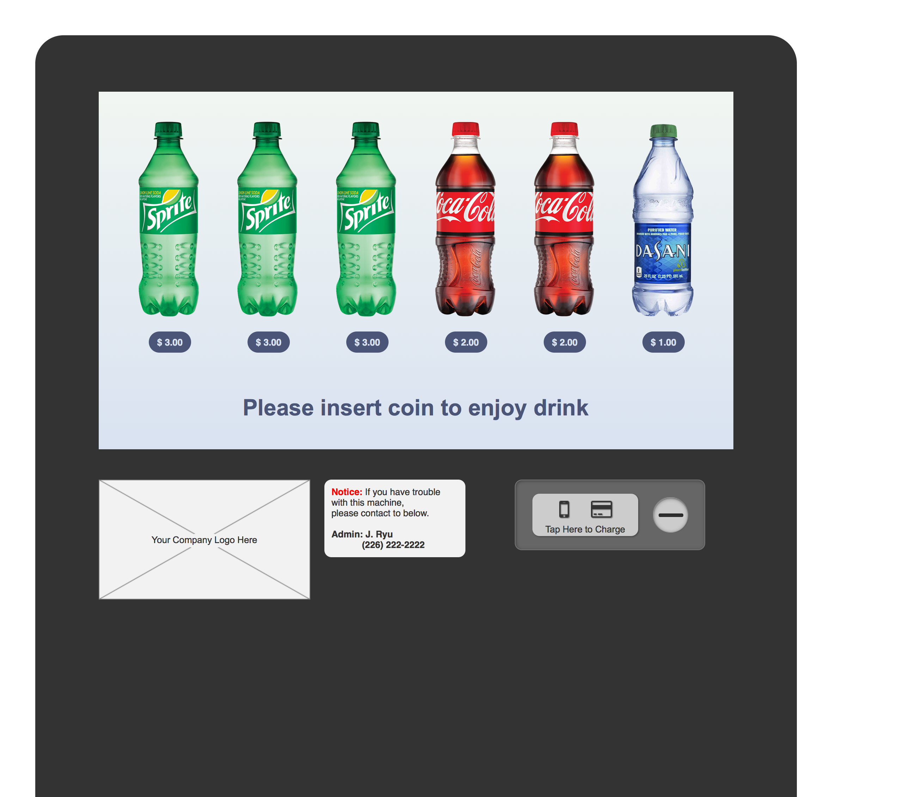
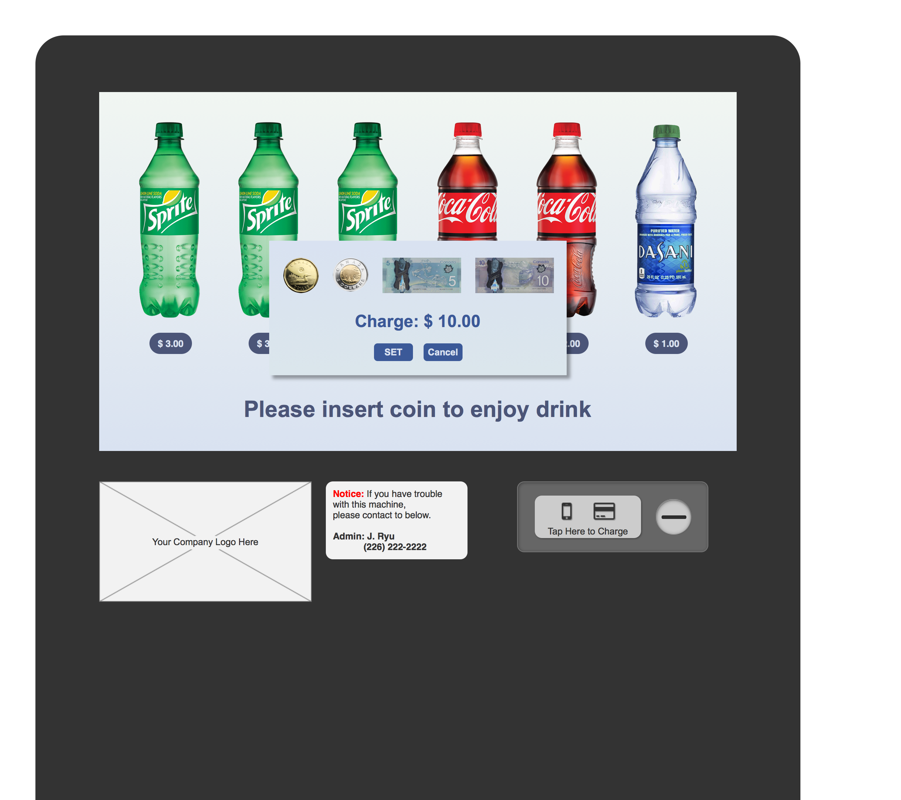
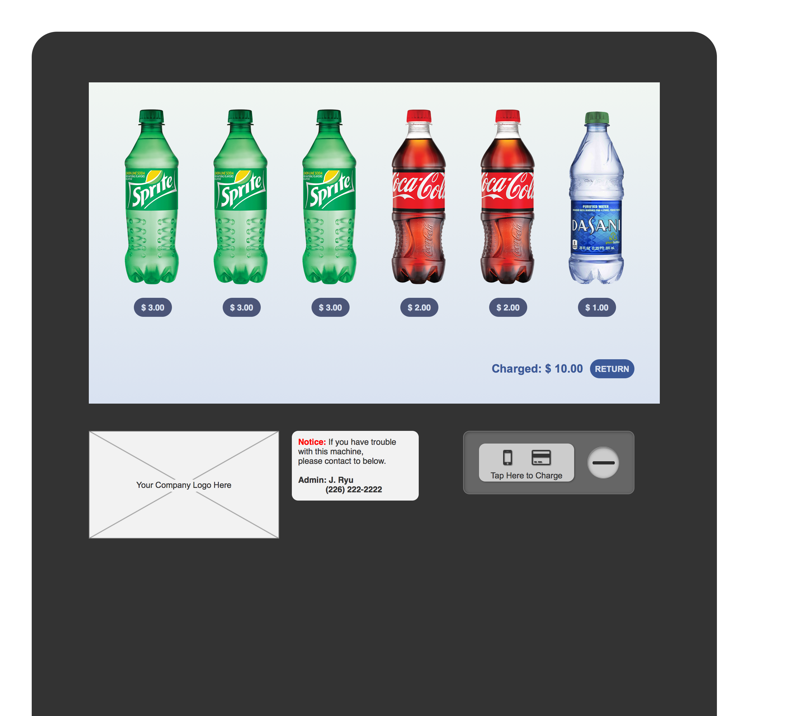
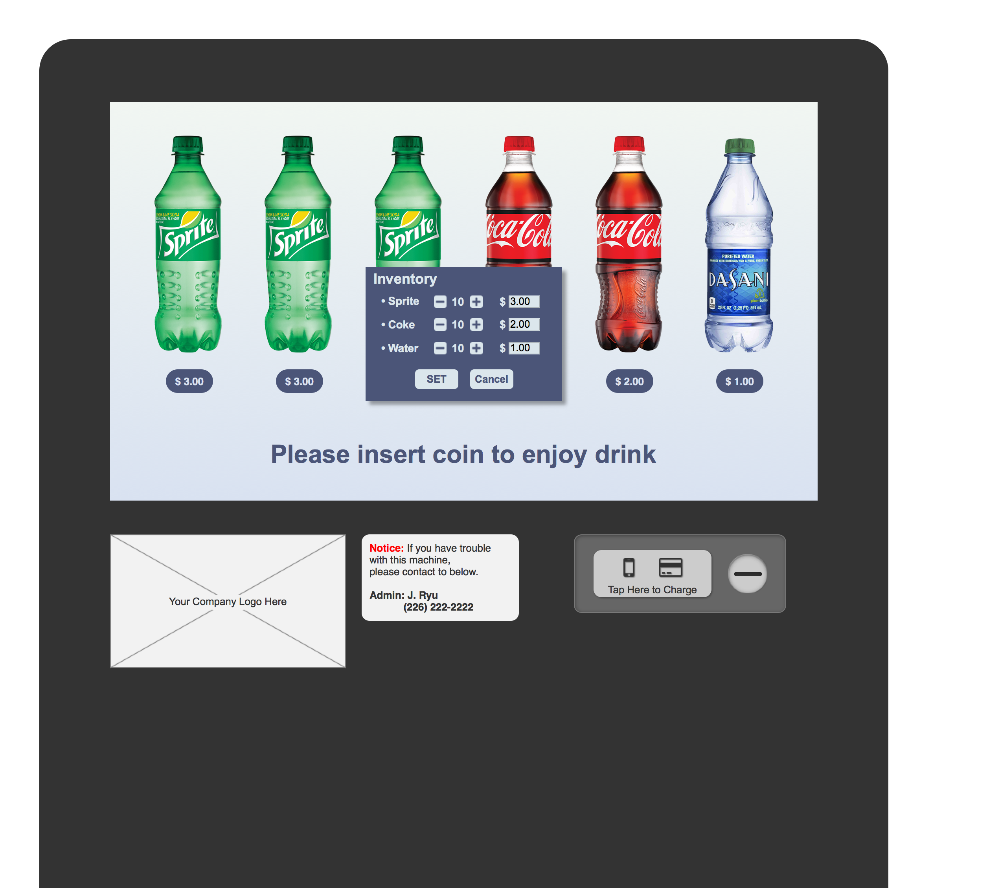

# VendingMachineUI
* UI Sketch for Virtual Vending Machine
* Tool: Axure RP 8
* Concept: Mimic LCD vending machine
* Directories and files
	* HTML: Converted sketch as HTML (index.html)
	* Resources: Image resources used in the ssketch
	* Screenshots: Screenshots of sketch[1](#footnote1)
	* VVM_Ryu.rp: Sketch file for Axure RP 8

## Initial screen

* Clickables: Bottles, Notice sticker, and Charge area

## Charge window

* Clickables: Currency, and Decision buttons

## After finish charging screen

* Clickables: Bottles, Notice sticker, Charge area, and Return button

## Admin inventory window

* Clickables: Plus/Minus buttons and Price text box for each items, and Decision buttons

<a name="footnote1">1</a>: All bottle images are [THE COCA-COLA COMPANY](http://www.coca-colacompany.com)'s design